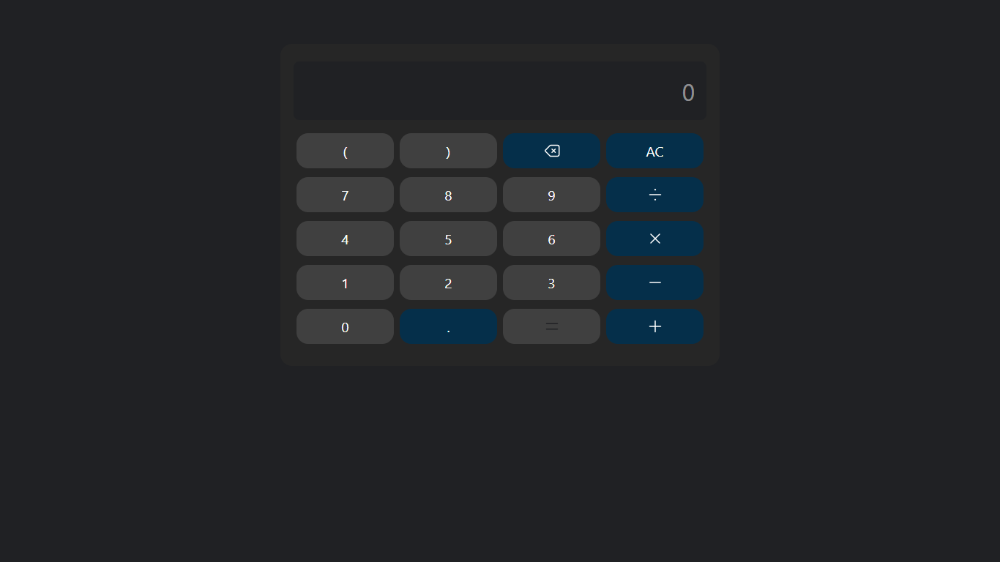

# javascript-mini-projects

This repository contains various JavaScript mini projects including a calculator app. The calculator app supports basic arithmetic operations and handles input errors gracefully by clearing the error message when the user starts a new input.

## Project Structure

- `calculator/`
  - `calculator.html` - The main HTML file for the calculator UI.
  - `calculator.js` - JavaScript logic for calculator operations and input handling.
- `input.css` - Styles for input elements.
- `output.css` - Compiled CSS output.
- `README.md` - Project documentation.

## Screenshot

Additional projects and features will be added over time.
