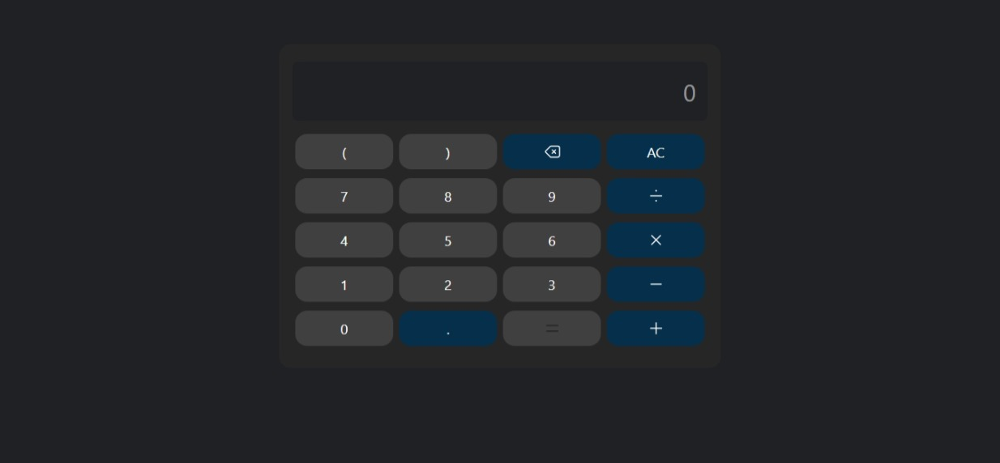

# javascript-mini-projects

This repository contains various JavaScript mini projects:

- **Calculator**: A simple calculator application with basic arithmetic operations, parentheses support, and error handling.
- **Countdown Timer**: A countdown timer that allows setting a future date and time, displaying remaining time in days, hours, minutes, and seconds.
- **Digital Clock**: A real-time digital clock displaying current time and date with toggle between 12-hour and 24-hour formats.
- **Roman Numeral Converter**: An application to convert between numbers (1-3999) and Roman numerals with input validation.
- **To-Do List**: A simple to-do list app for adding, completing, and removing tasks with localStorage persistence.

## Project Structure

- `calculator/`
  - `index.html` - The main HTML file for the calculator UI.
  - `calculator.js` - JavaScript logic for calculator operations and input handling.
  - `output.css` - Compiled CSS.
  - `README.md` - Project documentation.
- `countdown-timer/`
  - `index.html` - Main HTML file.
  - `countdown.js` - JavaScript logic for timer functionality.
  - `output.css` - Compiled CSS.
  - `README.md` - Project documentation.
- `digital-clock/`
  - `index.html` - Main HTML file.
  - `clock.js` - JavaScript logic for clock display.
  - `output.css` - Compiled CSS.
  - `README.md` - Project documentation.
- `roman-numeral-converter/`
  - `index.html` - Main HTML file.
  - `converter.js` - JavaScript logic for conversions.
  - `output.css` - Compiled CSS.
  - `README.md` - Project documentation.
- `todo-list/`
  - `index.html` - Main HTML file.
  - `todo.js` - JavaScript logic for task management.
  - `output.css` - Compiled CSS.
  - `README.md` - Project documentation.
- `input.css` - Styles for input elements.
- `output.css` - Compiled CSS output.
- `README.md` - Project documentation.
- `projects-img/` - Folder containing project screenshots.

## Scripts

- `npm run victor` - Runs Tailwind CSS CLI in watch mode to compile `input.css` to `output.css`.
- `npm run copy` - Copies the compiled `output.css` file to each project's directory.
- `npm run deploy` - Deploys the project using GitHub Pages.

## Screenshots

### Calculator

### Countdown Timer

### Digital Clock

### Roman Numeral Converter

### To-Do List

Additional projects and features will be added over time. For detailed setup instructions, features, and usage, refer to each project's individual README.md file.
