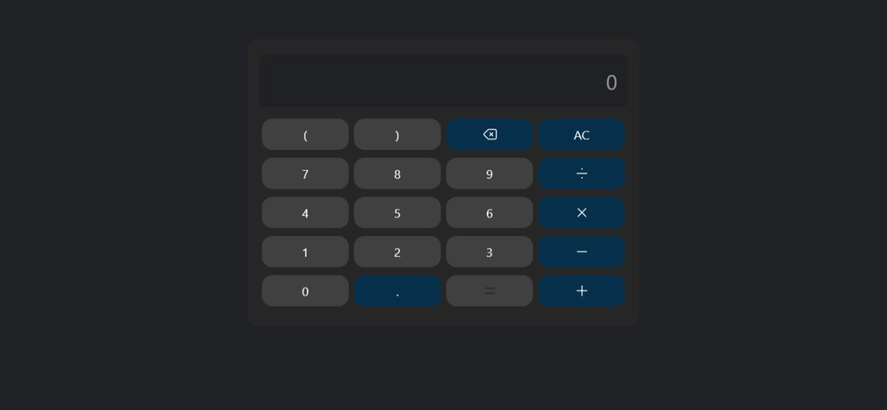

# JavaScript Calculator

A simple calculator application built with HTML, CSS, and JavaScript.

## Setup

1. Open `index.html` in a web browser.

## Features

- Basic arithmetic operations: addition, subtraction, multiplication, division
- Support for parentheses in expressions
- Clear (AC) and backspace functionality
- Error handling for invalid inputs
- Input validation to prevent consecutive operators

## Screenshots

## Deployed Portfolio Link

[Your Portfolio Link]()
