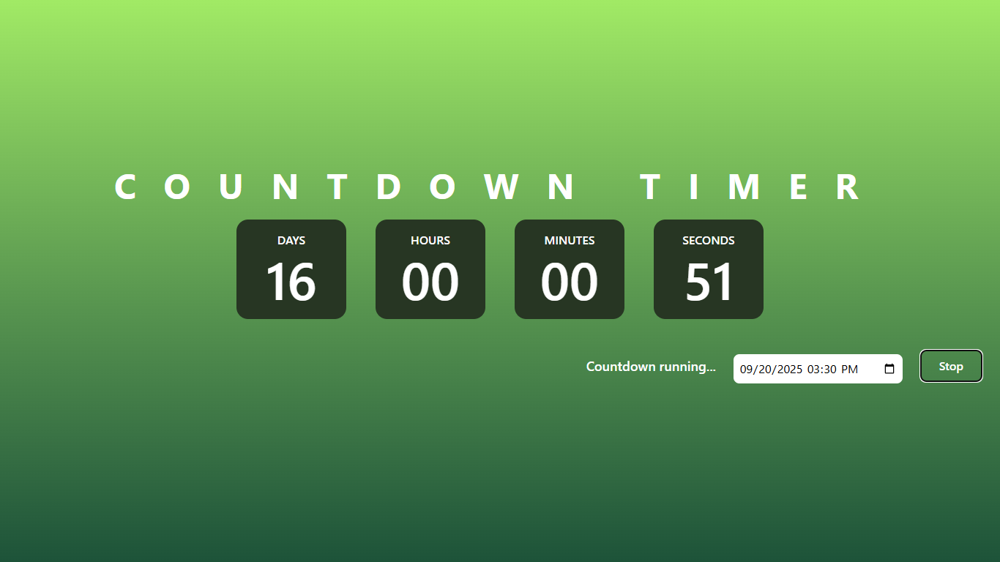

# Countdown Timer

A countdown timer application that allows users to set a future date and time and displays the remaining time.

## Setup

1. Open `index.html` in a web browser.

## Features

- Set a future date and time using the datetime input
- Displays countdown in days, hours, minutes, and seconds
- Start and stop the countdown
- Alerts when the countdown reaches zero
- Input validation for future dates only

## Screenshots

## Deployed Link

[https://vo-countdown-timer.vercel.app/]()
