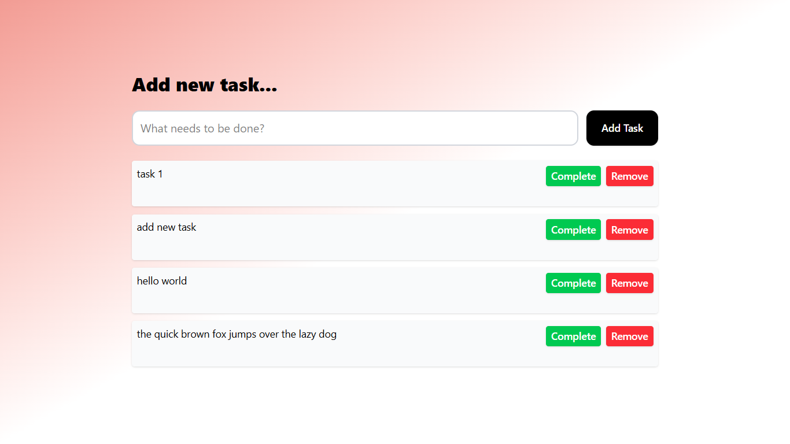

# To-Do List App

A simple to-do list application for managing tasks.

## Setup

1. Open `index.html` in a web browser.

## Features

- Add new tasks
- Mark tasks as complete or undo completion
- Remove tasks
- Data persistence using localStorage
- Keyboard support (Enter to add task)

## Screenshots

## Deployed Portfolio Link

[Your Portfolio Link]()
